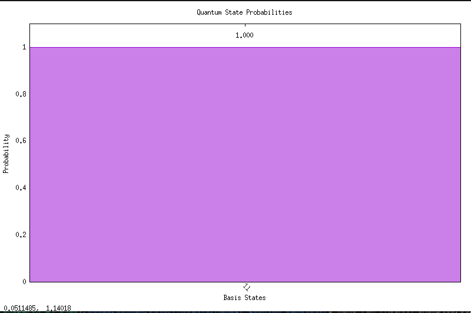
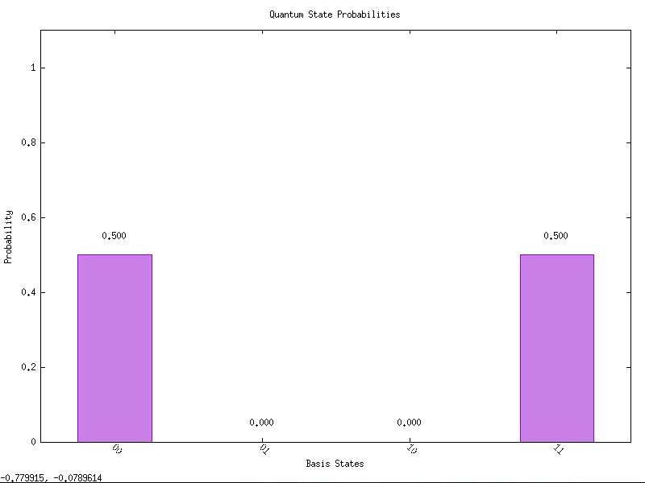
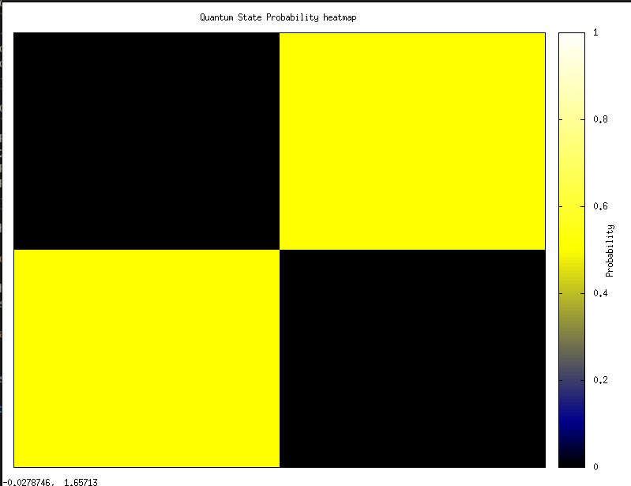

# MimiQ: A Quantum Circuit Simulator

[](https://isocpp.org/)
[](https://opensource.org/licenses/MIT)
[](https://www.openmp.org/)
[](https://www.mpi-forum.org/)

A lightweight, modern C++ library for simulating quantum circuits. This project provides a core QuantumCircuit class to build, manipulate, and measure N-qubit systems. It is capable of simulating both superposition and entanglement using a full state vector representation.

The repository also includes a command-line application that serves as a demonstration of the library's features.


## Features

* **Core C++ Library**: A self-contained set of classes of quantum simulation that can be easily integrated into your own C++ projects :) .
* **N-Qubit Simulation**: Simulate a quantum system with any number of qubits ($N$).
* **State Vector Model**: Uses a single state vector of $2^N$ complex amplitudes to accurately model entanglement and superposition.
* **Rich Gate Set (there is more to add honetly)**:
    * **Single-Qubit**: 
        * Pauli Gates: **X, Y, Z**
        * Superposition: **Hadamard (H)**
        * Phase Gates: **S, S-Dagger, T, T-dagger, Phase(P)**
        * Rotation Gates: **Rx, Ry, Rz**
    * **Controlled Gates**:
        * Entangling Gates: **CX(CNOT), CY, CZ, CH**
        * Controlled Phase: **CS, CS-dagger, CT, CT-dagger, CP**
        * Controlled Rotations: **CRx, CRy, CRz**
* **Measurement Modes**:
    1. **Run**: Simulate n shots to get a statistical distribution of outcomes without destroying the state.
    2. **Collapse**: Simulate a destructive measurement, collapsing the wave function to a single, definite state.
    3. **Partial Measurement**: Measure individual or ranges of qubits.
    4. **Expectation Value**: Calculate the expectation value of the Z operator (expectZ).

* **Visualization Tools**:
    1. **Circuit Diagram**: Renders an ASCII diagram of the circuit you've built.

    2. **State Vector**: Display the full complex state vector.

    3. **Probabilities**: Display the probabilities of all possible outcomes.

    4. **Probability Graph**: Uses GNUplot to generate a bar graph of state probabilities.

    5. **Heat Map**: Uses GNUplot to generate a 2D heat map of state probabilities.

---

## Getting Started

### Requirements
* A modern C++ compiler (C++11 or later), such as g++, Clang, or MSVC.

* The make build automation tool.

* GNUplot installed and added to your PATH.

### Installation & Setup
**On Linux & macOS**

On most Linux distributions and macOS, g++ and make are either pre-installed or can be easily installed through your system's package manager.

**On Debian/Ubuntu**: 
```
sudo apt-get install build-essential
sudo apt install gnuplot
```

**On macOS**: Install the Command Line Tools by running xcode-select --install in your terminal.

**On Windows**:
Windows does not come with make or g++ by default. The recommended way to get them is by installing MSYS2, which provides a complete GNU development environment.

Download and install MSYS2 from the official website: https://www.msys2.org/

After installation, open the MSYS2 MINGW64 shell from the Start Menu.

Install the make and g++ toolchain by running the following command in the shell:
```
pacman -S --needed base-devel mingw-w64-x86_64-toolchain
```

(Optional but recommended) Add the MinGW-w64 bin folder to your Windows PATH environment variable to run make and g++ from any terminal (like PowerShell or Command Prompt). The path is typically C:\msys64\mingw64\bin.

Go to SourceForge abd install GNUPlot and add to the environment variables. 


### Build and Run
1.  **Clone the repository:**
    ```bash
    git clone [https://github.com/Shanwis/MimiQ.git](https://github.com/Shanwis/MimiQ.git)
    cd MimiQ
    ```

2.  **Run the make file**
    ```bash
    make
    ```

     To use the library in your own project copy the include and lib files to you project
    ```bash
    MyQuantumApp/
    ├── include/
    │   └── MimiQ/
    │       ├── QuantumCircuitBase.h
    │       ├── QuantumCircuitParallel.h
    │       └── QuantumCircuitSerial.h
    ├── lib/
    │   └── libMimiQ.a
    ├── src/
    │   └── main.cpp
    └── Makefile
    ```
    When compiling main.cpp (or any other files)

    ```bash
    g++ -fopenmp src/main.cpp -Iinclude -Llib -lMimiQ -o Output
    ```

    use mpic++ if including the QuantumCircuitMPI.h file as well

    ```bash
    mpic++ -fopenmp src/main.cpp -Iinclude -Llib -lMimiQ -o Output
    ```

    To run the interative CLI we made for seeing the library in action:
    ```bash
    make run
    ```

    To try running a code using the library inside the directory
    ```bash
    make run PROGRAM=<program location/name>
    ```

    To run the benchmark program to compare the serial and parallel implementation:
    ```bash
    make benchmark
    ```

3. **After use**
    ```bash
    make clean
    ```
## Usage

### 1. Executing Code in the directory

#### 1. Super Dense Coding

Executing:

```bash
make run PROGRAM=examples/superdensecoding.cpp
```
You will get the output:
```bash
Enter the 2 bit string to be sent: 11
--- Circuit Diagram ---
q0 [H][C][Y][C][H]
q1 ---[X]---[X]---
-----------------------
2-Qubit Measurement Results
Probability of |11>: 1.000000
----------------------------
Displaying graph with gnuplot...
Press Enter to continue...
```


Checkout **examples/superdensecoding.cpp** for the code

#### 2. An SSM

Executing:

```bash
make run PROGRAM=examples/SSM.cpp
```
You will get the output:
```bash
EPOCH 0  RMSE: 0.080285

-11.7003, 3.53799, -1.08234, 2.06548, 5.47658, -2.46457, 

EPOCH 1  RMSE: 0.062459

-11.3546, 9.34942, -1.70043, 1.79972, 10.5911, -4.43952, 

EPOCH 2  RMSE: 0.079093

-20.4111, 5.55501, 0.0631731, 8.74371, 13.8511, -15.0363,
.
.
.
.
.
EPOCH 197  RMSE: 0.078105

-1106.75, -418.024, -30.0773, 41.3933, -45.8336, -111.904, 

EPOCH 198  RMSE: 0.070278

-1113.75, -419.026, -31.9248, 36.9935, -53.4073, -110.739, 

EPOCH 199  RMSE: 0.061534

-1119.79, -422.281, -27.726, 40.5171, -51.7611, -112.317, 

```

Checkout **examples/SSM.cpp** for the code

### 2. Interactive CLI 

Once the program is running, it will first ask for the number of qubits you want to simulate. After that, you will be presented with the main menu.

```
--- Menu ---
1. Apply Gate (includes measurement of single qubits)
2. Display Circuit
3. Measure Circuit(Collapses)
4. Print State Vector (Debug)
5. Print probabilities (Debug)
6. Display probability graph
7. Display heat map representation
8. Exit
Your choice:
```

Simply enter the number corresponding to the action you want to take. When applying gates, the program will prompt you for the gate type and the target/control qubits.

#### Example: Creating a Bell State (Entanglement)

Here's how to create the famous entangled Bell state $\frac{1}{\sqrt{2}}(|00\rangle + |11\rangle)$:

1.  Start the simulator with **2 qubits**.
2.  Choose option **1. Apply Gate (includes measurement of single qubits)**, then apply an **H** gate to qubit **0**.
3.  Choose option **1. Apply Gate (includes measurement of single qubits)** again, then apply a **C** (CNOT) gate with control qubit **0** and target qubit **1**.
4.  Choose option **2. Display Circuit**. The output will be:
    ```
    --- Circuit Diagram ---
    q0 [H][C]
    q1 ---[*]
    -----------------------
    ```
5.  Choose option **5. Print probabilities (Debug)**. The output will show the classic signature of entanglement:
    ```
    Probabilities of states.
    2-Qubit Measurement Results
    Probability of |00>: 0.500000
    Probability of |11>: 0.500000
    ----------------------------
    ```
6. Choose option **6. Display probability graph** The output will show the graph with probability:

    

7. Choose option **7. Display heat map representation** The output will show a heat map representation of the probabilities associated with the states.

    

8. Choose option **3. Measure Circuit(Collapses)** the system collapses to a single state.

    ```bash
    Your choice: 3

    Measuring the current state.
    00
    ```
    Here it colllapsed to 00 state. The circuit will look like:
    ```bash
    --- Circuit Diagram ---
    q0 [H][C][M]
    q1 ---[*][M]
    -----------------------
    ```
    The probability also changes:
    ```bash
    Probabilities of states.
    2-Qubit Measurement Results
    Probability of |00>: 1.000000
    ----------------------------
    ```


This result demonstrates that a measurement will yield either `|00>` or `|11>` with equal probability, but never `|01>` or `|10>`. The fates of the two qubits are linked!

### 3. Benchmark

When you get it running it will ask for number of qubits and threads after which it will run the serial and parallel versions of the simulator for 500 randomly applied gates.

```bash
--- Quantum Simulator Benchmark ---
Enter the number of qubits (e.g., 10): 15
Enter the number of threads for the parallel version: 5

Preparing to run a random circuit with 500 gates on a 15-qubit system.

--- Running Serial Benchmark ---
Serial execution time: 0.251818 seconds

--- Running Parallel Benchmark (5 threads) ---
Parallel execution time: 0.0829637 seconds

-----------------------------------------------------------
Speedup: 3.03527x
--By Ashwin S, 2023BCS0044 & Elhan B Thomas, 2023BCS0119--
```

## Quick API reference

### Base Class: `QuantumCircuitBase`

| Category                           | Methods                                                                                        | Description                        |
| ---------------------------------- | ---------------------------------------------------------------------------------------------- | ---------------------------------- |
| **Initialization**                 | `QuantumCircuitBase(int n)`                                                                    | Create an N-qubit system           |
| **Single Qubit Gates**             | `H()`, `X()`, `Y()`, `Z()`, `S()`, `T()`, `P(theta)`                                           | Apply single-qubit transformations |
| **Rotation Gates**                 | `Rx(theta)`, `Ry(theta)`, `Rz(theta)`                                                          | Rotation about X, Y, Z axes        | 
| **Controlled Gates**               | `CX()`, `CZ()`, `CH()`, `CY()`, `CS()`, `CT()`                                                 | Apply controlled operations        | 
| **Parameterized Controlled Gates** | `CP(theta)`, `CRx(theta)`, `CRy(theta)`, `CRz(theta)`                                          | Controlled rotations               |  
| **Measurement**                    | `collapse()`, `run(num_shots)`, `measure_single_qubit()`, `measure_range_of_qubits()`          | Perform measurements               | 
| **Reset**                          | `reset(int)`, `resetAll(int index)`                                                            | Reset qubits to |0⟩                |
| **Visualization**                  | `printCircuit()`, `printState()`, `printProbabilities()`, `displayGraph()`, `displayHeatMap()` | Display system information         | 

### Parallel Class: `QuantumCircuitParallel`

* inherits from base
* overrides `applySingleQubitOp()` and `applyControlledQubitOp()` and uses openMP for thread-level parallelism

compile using

```bash
g++ -fopenmp main.cpp -Iinclude -Llib -lMimiQ -o parallel_sim
```

### Distributed Class: `QuantumCircuitMPI`

* inherits from base
* overrides `applySingleQubitOp()` and `applyControlledQubitOp()` and uses MPI for distributed state-vector management

compile using

```bash
mpic++ main.cpp -Iinclude -Llib -lMimiQ -o mpi_sim
```
to run across processes:
```bash
mpirun -np 4 ./mpi_sim
```

## Project Structure

```bash
MimiQ/
├── examples
│   ├── bellstate.cpp
│   ├── MPI_test.cpp
│   ├── QuantumTeleportation.cpp
│   ├── SSM.cpp
│   └── superdensecoding.cpp
├── include
│   └── MimiQ
│       ├── QuantumCircuitBase.h
│       ├── QuantumCircuitMPI.h
│       ├── QuantumCircuitParallel.h
│       ├── QuantumGates.h
│       └── QuantumVisualization.h
├── photos
│   ├── graphusinggnuplot.png
│   └── heatmaprepbellstateMimiQ.png
├── src
│   ├── QuantumCircuitBase.cpp
│   ├── QuantumCircuitMPI.cpp
│   ├── QuantumCircuitParallel.cpp
│   └── QuantumVisualization.cpp
├── Benchmark.cpp
├── interactive_cli.cpp
├── LICENSE
├── Makefile
└── README.md

6 directories, 21 files
```

## Future Scope

* **Enhanced MPI scaling** for extremely large qubits sizes
* **More gate types** including arbitrary unitary and multi-controlled gates
* **Support for QML** by adding more functions facilitating it
* **Benchmark using benchpress** which is used for qiskit
* **Implement more algorithms in the simulator**
* **Add more robust backends** using CUDA, etc.

## License

This project is licensed under the MIT License. See the `LICENSE` file for details.
